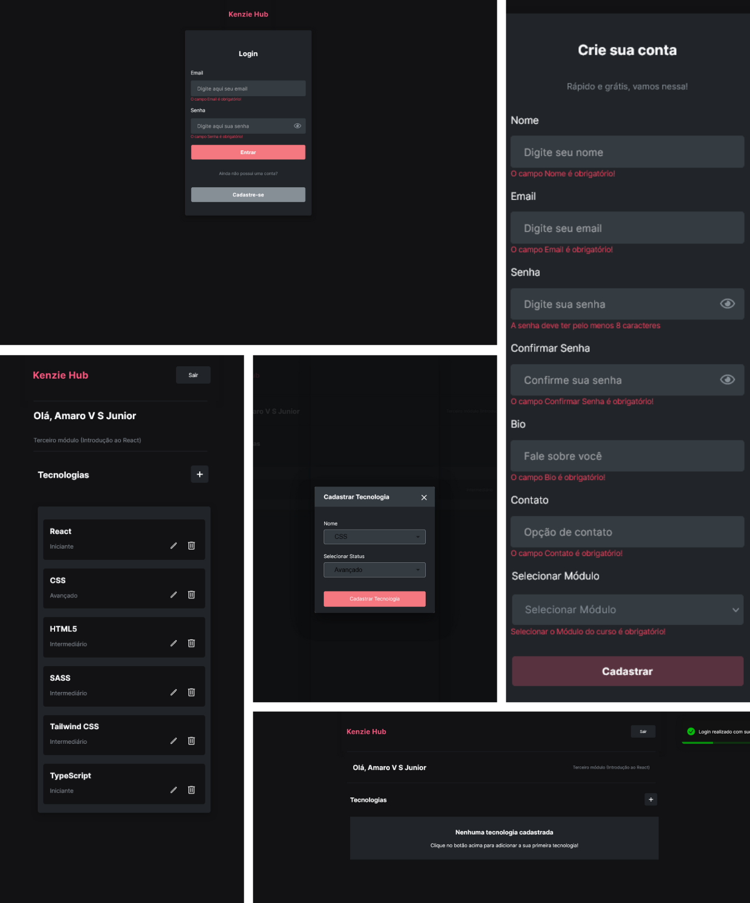

# Kenzie Hub




Aplicação fullstack com frontend React (Vite) e API própria (Express + JWT + Prisma/Postgres), configurada por ambiente, CORS por allowlist e domínio validado/normalizado. O CI roda lint/build no frontend e testes de API com Supertest.

## Links Importantes

- Aplicação: https://kenzie-hub-seven-blue.vercel.app/
- Código-fonte: https://github.com/JrValerio/Kenzie-Hub

## Quick Start

```bash
# instalar dependências do frontend (raiz)
npm ci

# instalar dependências da API
npm --prefix api ci

# rodar frontend + API juntos
npm run dev:all
```

Para rodar em terminais separados:

```bash
npm run dev:api
npm run dev
```

Testes da API:

```bash
npm --prefix api run test
```

## Funcionalidades

- Cadastro de usuário
- Login e logout
- Persistência de sessão via JWT
- Dashboard privada
- CRUD de tecnologias

## Destaques

- Integração de frontend React com API REST.
- API incluída (Express + JWT + Prisma/Postgres) para rodar sem depender de endpoints externos.
- Configuração segura via ambiente: `JWT_SECRET` obrigatório em produção e CORS por allowlist (`FRONTEND_URL`).

## Estrutura

- `src/components`: componentes reutilizáveis
- `src/pages`: páginas da aplicação
- `src/providers`: contextos de estado
- `src/routers`: rotas públicas e privadas
- `src/services`: camada de API do frontend
- `src/styles`: estilos (SCSS)
- `api`: backend (Express + Prisma + PostgreSQL)

## Arquitetura

```text
┌────────────────────────────┐
│ Frontend (Vercel / React)  │
└──────────────┬─────────────┘
               │
               ▼
┌────────────────────────────────────┐
│ API (Railway / Express + JWT)      │
└──────────────┬─────────────────────┘
               │
               ▼
┌────────────────────────────┐
│ PostgreSQL (Railway)       │
└────────────────────────────┘
```

## Configuração (Frontend)

O frontend usa `VITE_API_URL` para apontar para a API.
Em desenvolvimento, se `VITE_API_URL` não estiver definida, o fallback é `http://localhost:3333`.

1. Crie `.env` na raiz:

```bash
VITE_API_URL=http://localhost:3333
```

Você também pode copiar de `.env.example`:

```bash
cp .env.example .env
```

2. Rode tudo:

```bash
npm run dev:all
```

## API Local

A API local está em `api/` e expõe:

- `POST /sessions`
- `POST /users`
- `GET /profile`
- `POST /users/techs`
- `PUT /users/techs/:techId`
- `DELETE /users/techs/:techId`

Instalação da API:

```bash
cd api
npm install
```

Configure `api/.env` com base em `api/.env.example`.
Rode migrações antes de iniciar a API pela primeira vez:

```bash
cd api
npm run migrate:dev
npm run seed
```

## Deployment (Vercel + Railway)

Este projeto roda em produção com:

- Frontend: Vercel (React + Vite)
- API: Railway (Express + JWT + Prisma)
- Banco: Railway PostgreSQL

### Deploy da API no Railway (monorepo)

1. Crie um projeto no Railway e conecte este repositório.
2. Adicione um PostgreSQL no mesmo projeto.
3. Configure o serviço da API:

- Root Directory: `api`
- Build Command: `npm install`
- Start Command: `npm run start:prod`

4. Configure variáveis de ambiente no serviço da API:

```bash
NODE_ENV=production
JWT_SECRET=um-segredo-forte
FRONTEND_URL=https://kenzie-hub-seven-blue.vercel.app
DATABASE_URL=postgresql://...
```

Em `NODE_ENV=production`, `FRONTEND_URL` é obrigatório para CORS por allowlist.

5. Após o primeiro deploy, aplique as migrações:

```bash
npm run migrate:deploy
```

Opcional (conta demo):

```bash
npm run seed
```

Healthcheck:

- `GET /health` -> `{ "status": "ok" }`

### Deploy do Frontend no Vercel

1. Configure a variavel de ambiente:

```bash
VITE_API_URL=https://SUA-API.railway.app
```

2. Rode um novo deploy.

### Production URLs

- Frontend: `https://SEU-FRONT.vercel.app`
- API: `https://SUA-API.railway.app`

### Security Notes

- `JWT_SECRET` deve ser forte e exclusivo por ambiente.
- `FRONTEND_URL` deve apontar apenas para o domínio do frontend em produção.

### Checklist de validação (produção)

- Registrar usuário (`POST /users`) -> `201`
- Login (`POST /sessions`) -> `200` + token
- Perfil (`GET /profile`) -> `200`
- Criar tech (`POST /users/techs`) -> `201`
- Editar tech (status acentuado/ASCII) -> `200`
- Status inválido -> `400`
- Delete tech -> `204`

## Case Study - Evolução para Mini-Produto

Este projeto começou como uma aplicação acadêmica dependente de API externa instável.
A evolução técnica incluiu:

### Arquitetura

- Remoção de dependência externa.
- Criação de API própria (`Express + JWT`).
- Migração de persistência em arquivo para Postgres com Prisma.

### Segurança

- `JWT_SECRET` obrigatório em produção.
- CORS restrito por `FRONTEND_URL` (allowlist).
- `.env` isolado e ignorado no versionamento.

### Domínio consistente

- Validação e normalização de status de tecnologia.
- Compatibilidade com entradas acentuadas e variações de encoding.
- Fonte única de verdade para regras de domínio (front + backend).

### Engenharia e Qualidade

- Script único `dev:all` (frontend + backend).
- Testes de API com Supertest (auth + CRUD + rotas protegidas).
- CI automático com lint/build/test em push e pull request.

## Decisões Técnicas

- CORS por allowlist: API aceita apenas o domínio oficial do frontend em produção.
- Separacao `app` e `server`: facilita testes sem subir listener HTTP.
- Prisma + Postgres: persistência transacional e schema versionado por migration.
- Status de tecnologia normalizado: evita inconsistências de acento/encoding.
- CI obrigatório: valida frontend e API em todo push para `main`.
